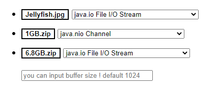

# DemoFile

# About The Projcet !

---

### project info

- spring boot project
- logback
- execute time logging -> Spring StopWatch
- using & focus file package -> `java.io, java.nio package`

프로젝트의 화면구성은 위의 이미지가 끝입니다 !

 
 
 

# You can this !

첨부파일 입출력 속도테스트를 위한거라 `index.html`을 제외하고 별도의 화면은 없습니다.

`spring boot` project이며 `file IO` 속도 테스트를 위해 다양한 `file IO class`를 사용하였음.

AOP를 통해 파일 입출력 method가 동작하는 시간 체크 기능이 구현 되어있습니다 . `selectbox`를 선택하고 `bufferSize`를 입력하여 file download를 진행하면서 `buffer size, file IO Class`에 따른 실행시간 `log`를 확인하며 test하면 됩니다.

`HomServiceImpl.java` local file path는 임의의 경로로 설정해야 합니다.

`index.html` 에서 테스트 하고싶은 file명을 변경해서 테스트해야합니다. ~~귀찮게 만들어서 죄송합니다 ㅠ~~

 
 
 

# License

---

**Distributed under the MIT License. See LICENSE.txt for more information.**

 
 
 

# Contact

---

심현섭 | Hyun Seob Shim

📬 orolsyeo@gmail.com

🕊 [@orolsyeo](https://twitter.com/orolsyeo)

git - [https://github.com/hyun-sseob/DemoFile](https://github.com/hyun-sseob/DemoFile)
